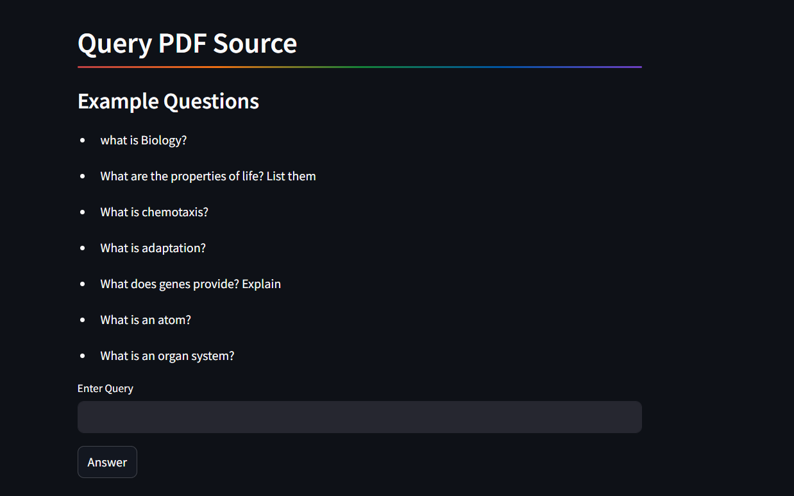

# Question Answering - RAG for a PDF file

This repository contains a Dockerized environment for running a Python script. The Docker container is set up to execute the script `run_app.py` located in the repository root.




## Prerequisites

- Docker installed on your local machine. You can download Docker from [https://www.docker.com/get-started](https://www.docker.com/get-started).

## Usage

### 1. Clone the Repository

Clone this repository to your local machine using Git:

```bash
git clone https://github.com/shantam94/Quantiphi-Assignment.git
cd your-repository
```

### 2. Build the Docker Image
Build the Docker image using the provided Dockerfile:

```bash
docker build -t python-script-container .
```

### 3. Run the container
Run the Docker container to execute the Python script `run_app.py`:


```bash
docker run python-script-container -p 8051:8051
Go To : http://localhost:8501/ 
for the app
```
here --db argument is for the selection of memory for vector database, f -> FAISS, else ChromaDB

If you do not wish to run via dockers:
```bash
python run_app.py --db f
```
